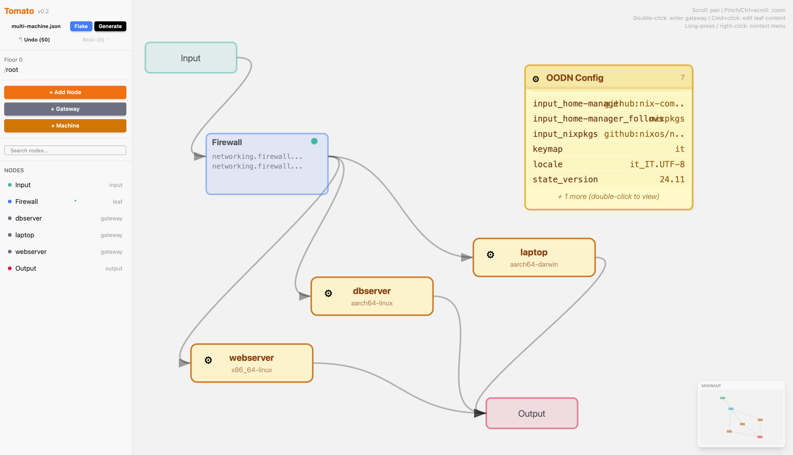

# Tomato

A hierarchical DAG engine for composable NixOS configuration management.

Tomato models system configurations as directed acyclic graphs organized in floors (levels). Each leaf node holds a NixOS configuration fragment. Gateway nodes point to subgraphs on the floor below. Walking the graph top-down in topological order composes a valid `configuration.nix` or `flake.nix` — which can be deployed to a NixOS machine via SSH with a single click.



## Quick Start

```bash
mix setup
mix phx.server
```

Open [localhost:4001](http://localhost:4001). Three demo graphs load automatically — switch between them via the Graph Manager (click the filename in the sidebar).

### Example 1 — `default.json` (simple traditional NixOS)

A single-machine traditional `configuration.nix` example. Good first walkthrough.

- **Root floor**: Networking → System → Services (gateway), with Firewall in parallel
- **Services subgraph**: PostgreSQL + Nginx
- **OODNs**: `hostname`, `timezone`, `locale`, `keymap`, `nginx_port`, `pg_port`
- **Backend**: Traditional (`configuration.nix`)

### Example 2 — `multi-machine.json` (flake with multiple servers)

A flake-based multi-machine setup showing per-machine OODN override and shared config.

- **Root floor**: shared Firewall + 3 machines
- **webserver** (NixOS, x86_64-linux): Nginx
- **dbserver** (NixOS, aarch64-linux): PostgreSQL
- **laptop** (Home Manager, aarch64-darwin): Git + Zsh
- **OODNs**: `input_nixpkgs`, `input_home-manager`, `input_home-manager_follows`
- **Backend**: Flake (`flake.nix` with mixed `nixosConfigurations` + `homeConfigurations`)

### Example 3 — `home-manager.json` (pure Home Manager dotfiles)

A developer dotfiles example — no NixOS server, just user-level configuration.

- **One Home Manager machine**: laptop (aarch64-darwin, user "alex")
- **Inside**: Git, Zsh + Starship, Neovim, Tmux, Alacritty, User Packages
- **OODNs**: `username`, `git_name`, `git_email`, flake inputs
- **Backend**: Flake (`flake.nix` with `homeConfigurations."alex@laptop"`)

## What's New in v0.2

| Feature | Description |
|---|---|
| **Flake backend** | Toggle between traditional `configuration.nix` and `flake.nix` output. OODN entries prefixed with `input_` become flake inputs |
| **Multi-machine** | Each machine is a gateway with metadata. Generate one flake with multiple `nixosConfigurations` entries |
| **Home Manager** | Machines can be `:nixos` or `:home_manager`. Generates `homeConfigurations` alongside NixOS configs |
| **Deploy modes** | Switch / Test / Dry Run / Diff / Rollback — all from the UI |
| **Content preview** | Leaf nodes show the first lines of their Nix content directly on the canvas |
| **Node search** | Find nodes by name or content across all subgraphs and floors |
| **Undo / Redo** | 50-snapshot mutation history with sidebar buttons |
| **Minimap** | Bottom-right overview of the current subgraph |

## How It Works

### The Graph

```
Floor 0 (root)
  Input → Networking → System → Services (gateway) → Output
          Firewall  ↗

Floor 1 (inside Services)
  Input → PostgreSQL → Output
          Nginx      ↗
```

- **Leaf nodes** hold Nix config fragments (e.g. `services.nginx.enable = true;`)
- **Gateway nodes** contain a subgraph on the floor below — composing complex configs from smaller pieces
- **Machine nodes** are gateways with metadata (`hostname`, `system`, `state_version`, `type`). Per-machine OODN override applies when walking inside a machine
- **OODN node** (Out-Of-DAG Node) is a singleton holding global variables (`${hostname}`, `${timezone}`, `input_nixpkgs`, etc.) referenced by leaf nodes via `${key}` placeholders
- **Edges** define dependency order — the walker traverses nodes in topological order

### Generate & Deploy

1. **Generate** — walks the graph, interpolates OODN variables, wraps fragments in either a NixOS module skeleton (traditional) or a `flake.nix` skeleton with `nixosConfigurations`/`homeConfigurations` → writes `.nix` file to `priv/generated/`
2. **Deploy modes** — pick from the generated output modal:
   - **Switch** — `nixos-rebuild switch` (apply + boot menu)
   - **Test** — `nixos-rebuild test` (apply without boot menu)
   - **Dry Run** — `nixos-rebuild dry-activate` (show what would change)
   - **Diff** — fetch current remote config and show line-by-line diff
   - **Rollback** — revert to the previous NixOS generation

Real services start, stop, and reconfigure on a real NixOS machine. Change `${nginx_port}` from `80` to `8080` in the OODN node → both the firewall rules and Nginx config update in one rebuild.

### Backend Toggle

Click **Traditional / Flake** in the sidebar header to switch output format:

- **Traditional** generates `configuration.nix` with imports, deployed via `nixos-rebuild switch`
- **Flake** generates `flake.nix` with inputs from `input_*` OODNs, multiple `nixosConfigurations` for multi-machine setups, deployed via `nixos-rebuild switch --flake .#hostname`

Flake inputs and `follows` declarations come from OODNs:

```
input_nixpkgs              = github:nixos/nixpkgs?ref=nixos-unstable
input_home-manager         = github:nix-community/home-manager
input_home-manager_follows = nixpkgs
```

### Multi-Machine

Each machine is a root-level gateway with metadata. The walker generates one `nixosConfigurations` (or `homeConfigurations`) entry per machine, with per-machine `${hostname}`, `${system_arch}`, `${state_version}`, and `${username}` overrides for OODN interpolation.

Shared leaf nodes at the root level get included in every machine's config — perfect for firewall rules, common packages, or base hardening.

### Template Library

Click **+ Add Node** to pick from predefined templates:

| Category | Templates |
|---|---|
| **Stacks** | Prometheus Stack (5 nodes), Grafana + Prometheus, Web Server Stack |
| **System** | System Base, Networking, Firewall, Admin User, Console |
| **Web** | Nginx, Nginx Reverse Proxy, Caddy |
| **Database** | PostgreSQL, MySQL, Redis |
| **Services** | OpenSSH, Docker, Tailscale, Fail2ban, Cron Jobs |
| **Monitoring** | Prometheus, Grafana |
| **Home Manager** | Git, Zsh, Neovim, Tmux, Starship, Direnv, Alacritty, User Packages |
| **Packages** | Dev Tools |

Stack templates create a **gateway with pre-wired child nodes** — e.g. Prometheus Stack creates Prometheus Base + Node Exporter + Scrape configs + Alert Rules, all connected and ready to deploy.

NixOS merges list and attribute set options automatically — `scrapeConfigs` from multiple nodes get concatenated into one `prometheus.yml`.

### OODN Variables

The OODN node is a singleton on the canvas holding global key-value pairs:

```
hostname    = tomato-node
timezone    = Europe/Rome
locale      = it_IT.UTF-8
keymap      = it
nginx_port  = 80
pg_port     = 5432
input_nixpkgs              = github:nixos/nixpkgs?ref=nixos-unstable
input_home-manager         = github:nix-community/home-manager
input_home-manager_follows = nixpkgs
```

Leaf nodes reference these with `${key}` syntax. The walker interpolates them at generation time. Change a value once, every referencing node updates. The visible OODN node caps at 6 entries with a `+N more` indicator — double-click to open the full editor.

## Canvas Interactions

| Action | Effect |
|---|---|
| **Click** | Select node |
| **Drag** | Move node |
| **Double-click gateway** | Enter subgraph |
| **Double-click leaf** | Edit content |
| **Cmd+click leaf** | Edit content |
| **Long-press / right-click** | Context menu |
| **Scroll / two-finger** | Pan canvas |
| **Pinch / Ctrl+scroll** | Zoom |

Context menu actions: Connect from/to, Duplicate, Rename, Disconnect all, Delete, Reverse edge, Fit to view, Reset zoom.

The sidebar provides node search, undo/redo, graph manager, backend toggle, generate, and node properties. The minimap (bottom-right of the canvas) shows the current subgraph at reduced scale.

## Deploy Configuration

To deploy generated configs to a NixOS machine, set your target via environment variables or `config/deploy.secret.exs`:

```bash
export TOMATO_DEPLOY_HOST=your-nixos-host
export TOMATO_DEPLOY_PORT=22
export TOMATO_DEPLOY_USER=root
export TOMATO_DEPLOY_PASSWORD=your-password
```

Or copy the example file:

```bash
cp config/deploy.secret.exs.example config/deploy.secret.exs
```

See `config/deploy.secret.exs.example` for the format. This file is gitignored.

## Architecture

```
lib/tomato/
  node.ex              # Node struct — :input, :output, :leaf, :gateway (+ machine meta)
  edge.ex              # Directed edge between nodes on same floor
  subgraph.ex          # Self-contained DAG on a floor
  graph.ex             # Top-level container with subgraphs, OODN registry, backend
  oodn.ex              # Out-of-DAG key-value pair
  store.ex             # GenServer — in-memory state, JSON persistence, PubSub, history
  constraint.ex        # DAG validation — cycles, structure, edges
  walker.ex            # Topological traversal + OODN interpolation + machine override
  backend/
    flake.ex           # Generates flake.nix with inputs/outputs/nixosConfigurations
  deploy.ex            # SSH/SFTP upload + nixos-rebuild (switch/test/dry/diff/rollback)
  template_library.ex  # Predefined NixOS + Home Manager templates (leaf + gateway stacks)
  demo.ex              # Seeds default and multi-machine demo graphs

lib/tomato_web/
  live/graph_live.ex   # Main LiveView — SVG canvas, sidebar, modals, minimap

assets/js/
  hooks/graph_canvas.js  # Drag, zoom/pan, long-press context menu, Bezier edges
```

### Persistence

Each graph is a single JSON file in `priv/graphs/`. The Graph Manager (click filename in sidebar) lets you create, load, save-as, and delete graphs. The JSON file is the source of truth — loaded into memory on startup, flushed on every mutation with 200ms debounce.

### Undo / Redo

The Store keeps a bounded history of the last 50 graph snapshots. Every mutation (add/remove/update node, edge, OODN, machine, backend toggle) pushes the prior state. OODN position drag is excluded from history to avoid noise.

### DAG Constraints

Enforced on every mutation: no cycles (Kahn's algorithm), single `:input`/`:output` per subgraph, edges same-floor only, gateway-subgraph integrity.

## Development

```bash
mix deps.get            # install dependencies
mix compile             # compile
mix phx.server          # start dev server at localhost:4001
iex -S mix phx.server   # start with interactive shell
mix test                # run tests (69 tests)
mix format              # format code
```

## Requirements

- Elixir 1.15+
- Erlang/OTP 26+

## Roadmap

See [docs/ROADMAP_v0.2.md](docs/ROADMAP_v0.2.md) for the v0.2 plan and [docs/REFACTOR_v0.3.md](docs/REFACTOR_v0.3.md) for the v0.3 refactor plan (god module split + nixpkgs options search).

## License

Apache License 2.0 — Copyright 2026 Alessio Battistutta. See [LICENSE](LICENSE).
